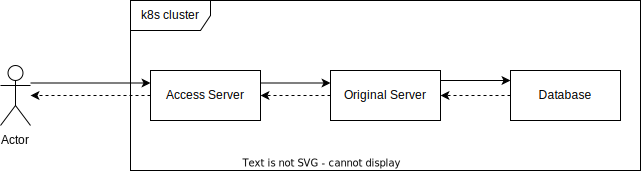
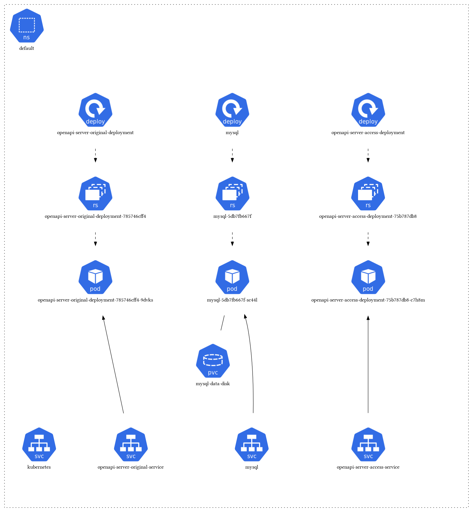

== Run Example

UPDATE

In this example, a server (Original Server) inside the cluster connects to a database inside the cluster. To access data of the original server, another server(Access Server) inside the cluster is used. The aceess server can be accessed from outside the cluster. The access server  will communicate to the original server to retrieve data and sends it to the user.





=== Requirements

- link:https://maven.apache.org/download.cgi[Maven] installed
- link:https://taskfile.dev/installation/[Taskfile] installed
- link:https://rancherdesktop.io/[Rancher Desktop] installed  with link:https://github.com/devonfw/ide[DevonIDE]
- locale Kubernetes Cluster started
- Behind VPN's activate wsl-vpnkit

=== Installation
[tabs]
====
Docker::
+
--
    - Run `task deployDocker`
--
Nerdctl::
+
--
    - Run `task deployNerd`
--
Docker behind VPN::
+
--
    - Run `task deployDockerVPN`
--
Nerdctl behind VPN::
+
--
    - Run `task deployNerdVPN`
--
====

=== Uninstallation
[tabs]
====
Docker::
+
--
    - Run `task removeDocker`
--
Nerdctl::
+
--
    - Run `task removeNerd`
--
Docker behind VPN::
+
--
    - Run `task removeDockerVPN`
--
Nerdctl behind VPN::
+
--
    - Run `task removeNerdVPN`
--
====

=== Using VPN
Using inside a VPN is currently only working with a work around:
When running `kubectl` commands prepend `wsl`

1. Start Rancher Desktop with vpn disabled
2. Enable VPN
3. Test connection with `wsl kubectl get all` 

=== What happened

1. For the original and access Server, a Dockerimage got created into a locale image repository
2. The helm chart inside openapi_helm_chart got installed
3. The Server and Database started and connected to each other
4. When using a vpn the helm commands got routed through the wsl vpn kit

=== Test
At `http://localhost:5030/guest` there is a list of invited guests 

If localhost is not working run 

```
kubectl get servie
```

Use the External Ip of the `openapi-server-access-service` instead of localhost
