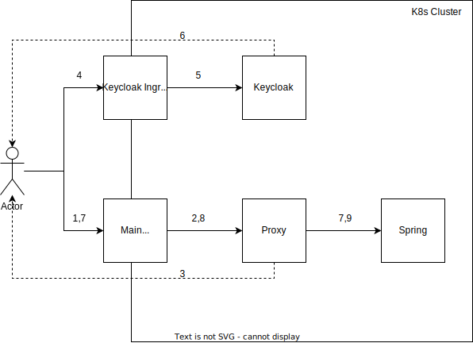

= Keycloak + Proxy

In this example a spring service is secured by an oauth2 Proxy with keycloak as identity provider.

== Required
- Rancher Desktop 
- Maven

== Install
- Run `./install.sh` set the flag `--ignore-block` to ignore blocked ports when installing
- Create a keycloak user with the group `groups`
- Test by trying to access link:http://localtest.me/api/serviceA/ 

== Uninstall
- Run `./uninstall.sh`

Set flag `--remove-db` to remove the everthing including percistent volume claims

== Add users

1. Login to the link:http://keycloak.localtest.me[keycloak ui] with username `admin` and
password `admin`
2. Select TestRealm from dropdown
3. Go to users
4. Click Create new user
5. Make sure to add a email and set verified to true
6. Let the user join the `groups` group
7. Click Save
8. Go to Credentials
9. Click Set Password
10. Create a new password with the option Temporary disabled